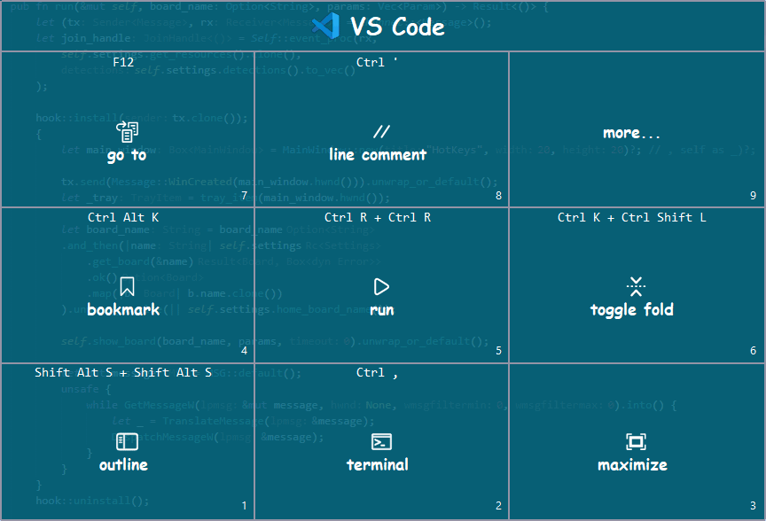

# HotKeys

A context-aware Windows automation tool that helps you work faster by mapping frequently-used actions to your numeric keypad. Press `Ctrl Alt NumPad_0` to bring up a customizable 3x3 board showing application-specific shortcuts, text snippets, or command sequences—then simply press a number key (1-9) to execute the action. Perfect for developers, writers, and power users who want quick access to repetitive tasks without memorizing dozens of keyboard shortcuts.
- [HotKeys](#hotkeys)
- [Usage](#usage)
- [Configuration](#configuration)
- [Build](#build)
- [Extending Functionality](#extending-functionality)
  - [Custom Actions](#custom-actions)
  - [Custom Board Types](#custom-board-types)
- [License](#license)

# Usage

HotKeys runs silently in the background (accessible via the system tray icon) until you activate it with the global hotkey `Ctrl Alt NumPad_0`. Here's how it works:

**When you press the hotkey:**

1. HotKeys detects which application is currently in focus
2. If you have a board configured for that application:
   - The 3x3 action board appears ([Image](docs/images/Image-1.png))
   - Select an action by pressing a number key (1-9) or clicking with your mouse
   - Press `Esc` to close the board without executing an action
3. If no board exists for the current application:
   - A prompt appears offering to configure a new board ([Image](docs/images/Image-3.png))

**Visual overview:**

[](docs/images/preconfigured-vs-new-board.gif)

# Configuration

Configuration is managed through JSON files in the `resources` folder. For detailed configuration documentation, see:

- [Configuration Guide](docs/configuration-guide.md) - Complete guide to settings structure, boards, padsets, color schemes, and layouts
- [Pads and Actions](docs/pads-and-actions.md) - Detailed documentation on configuring pads and action types with examples


# Build

**Prerequisites:**
- Rust toolchain (install from [rustup.rs](https://rustup.rs/))
- Windows development environment

**Building the project:**

```bash
# Development build
cargo build

# Release build (optimized)
cargo build --release
```

**Running the application:**

```bash
# Run in development mode
cargo run

# Run with custom configuration directory
cargo run -- --config_dir ./resources

# Run with a specific board
cargo run -- --board edge

# Run with extra parameters (e.g., initial path)
cargo run -- --board edge -- --initial_path "edit/pad9"

# Run the release build
./target/release/hotkeys.exe

# Run release build with arguments
./target/release/hotkeys.exe --config_dir C:\MyConfig --board myboard
```

**Command line arguments:**

- `--config_dir <path>` - Configuration directory path (default: `<exe_dir>/resources`)
- `--board <name>` - Initial board to display (default: `home`)
- `-- --<key> <value>` - Extra parameters passed after `--` (e.g., `--initial_path "edit/colors"`)

The release executable will be located at `target/release/hotkeys.exe`. The application runs in the system tray and can be triggered using `Ctrl Alt NumPad_0`

# Extending Functionality

HotKeys can be extended with custom actions and custom board types by implementing Rust traits and registering factory instances.

## Custom Actions

To add custom action types beyond the built-in ones (Shortcut, Text, Line, Paste, etc.):

1. Implement the `ActionFactory` trait:
   ```rust
   pub trait ActionFactory<R: SettingsRepository + SettingsRepositoryMut> {
       fn create_action(&self, context: &ActionRuntimeContext<R>, action: &ActionParams)
           -> Option<Box<dyn Action>>;
   }
   ```

2. Implement the `Action` trait for your custom action:
   ```rust
   pub trait Action {
       fn run(&self) -> ActionResult;
       fn requires_reload(&self) -> bool { false }
       fn requires_restart(&self) -> bool { false }
   }
   ```

3. Register your factory in `src/main.rs`

## Custom Board Types

To add custom board types beyond the built-in ones (static, home):

1. Implement the `BoardFactory` trait:
   ```rust
   pub trait BoardFactory<R: SettingsRepository + SettingsRepositoryMut> {
       fn create_board(
           &self,
           context: &BoardRuntimeContext<R>,
           board: &crate::core::Board,
           params: Vec<Param>
       ) -> Result<Box<dyn BoardComponent>, Box<dyn std::error::Error>>;
   }
   ```

2. Implement the `BoardComponent` trait for your custom board

3. Register your factory in `src/main.rs`

**Registering custom Action/Board factories:**

Both registries are created in `src/main.rs` at lines 166-171:
```rust
let action_factory_registry = ActionFactoryRegistry::<Settings>::new();
let board_factory_registry = BoardFactoryRegistry::<Settings>::new();

// Register custom factories
action_factory_registry.register_factory("my_custom_action", Box::new(MyActionFactory));
board_factory_registry.register_factory("my_custom_board", Box::new(MyBoardFactory));
```

Once registered, custom actions can be used in configuration via the `Custom` action type, and custom boards via the `custom` board kind.

# Documentation

Documentation for this project was collaboratively created with [Claude](https://claude.ai) (Anthropic's AI assistant). While the technical content and examples reflect the actual implementation, Claude helped structure, write, and refine the documentation for clarity and accessibility.

# License

This project is licensed under the MIT License - see the [LICENSE](LICENSE) file for details.


