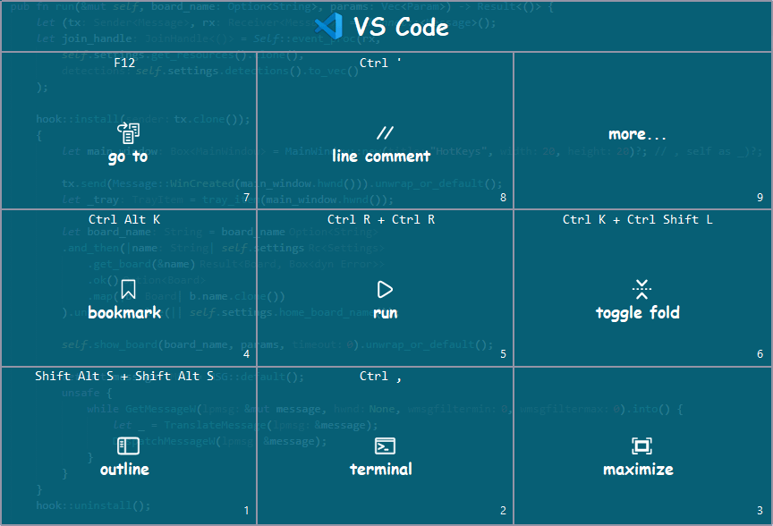

# Configuration Guide

HotKeys uses JSON-based configuration files located in the `resources` folder. This guide covers the structure and available options for customizing the application's behavior and appearance.

## Configuration Files

**[log.toml](../resources/log.toml)** - Logging configuration
Controls application logging levels and output. See the [Rust log documentation](https://docs.rs/log/latest/log/) for details on configuring logging behavior.

**[settings.json](../resources/settings.json)** - Main configuration file
Contains all application settings including boards, actions, color schemes and text styles. Most configuration can be done through the application's UI, though you can also edit the JSON files directly for advanced customization or bulk changes.

## Settings File Structure

The main settings file (`settings.json`) contains all the core configuration for the HotKeys application. To organize large configurations, you can split settings into separate "include" files (also called "component" files) that are referenced from the main file.

**Main settings file** - Contains all required root-level attributes and references to include files.

**Include files** - Optional component files that can contain subsets of configuration (boards, padsets, text_styles, color_schemes). Include files are referenced using the `includes` attribute in the main file. Paths are relative to the main settings folder.

**Example structure:**
```
resources/
├── settings.json           (main file)
├── settings.styling.json   (include file with color schemes and text styles)
└── boards/
    ├── settings.board.chrome.json
    └── settings.board.code.json
```

**Example main file referencing includes:**
```json
{
  "timeout": 5,
  "feedback": 50,
  "editor": "notepad.exe",
  "boards": [...],
  "padsets": [...],
  "color_schemes": [...],
  "text_styles": [...],
  "layout": {...},
  "includes": [
    "settings.styling.json",
    "boards/settings.board.chrome.json"
  ]
}
```

### Configuration Attributes

| Attribute| Main| Include| Description |
| -------| -------| ---------|---------|
| timeout| ✅| ❌| Timeout in seconds before the board auto-closes.|
| feedback| ✅| ❌| Visual feedback delay for the pressed pad in milliseconds. |
| editor| ✅| ❌| Path to text editor used for editing settings.|
| natural_key_order| ✅| ❌| Whether to use natural key order for regular number keys.|
| boards|  ✅| ✅| List of `Board` configuration objects.|
| padsets|  ✅| ✅| List of `Padset` configuration objects.|
| text_styles|  ✅| ✅| List of `TextStyle` configuration objects.|
| color_schemes|  ✅| ✅| List of `ColorScheme` configuration objects.|
| layout| ✅| ❌| `Layout` object, defines window position and size.|
| includes| ✅| ❌| List of referenced `include` file paths, relative to the `main` settings folder.|

---

## timeout

**Type:** `integer`
**Default:** `5`
**Range:** `0` to `10`
**Required:** Yes
**Available in:** Main file only

Timeout in seconds before the board automatically closes. When set to `0`, the board will remain open indefinitely until the user manually closes it or selects an action.

**Example:**
```json
{
  "timeout": 5
}
```

---

## feedback

**Type:** `integer`
**Default:** `50`
**Range:** `0` to `500`
**Required:** Yes
**Available in:** Main file only

Visual feedback delay in milliseconds when a pad is pressed. This provides visual confirmation that the action was triggered before the board closes or navigates to another board.

**Example:**
```json
{
  "feedback": 50
}
```

---

## editor

**Type:** `string`
**Default:** `"notepad.exe"`
**Required:** Yes
**Available in:** Main file only

Path to the text editor executable used for editing text actions and configuration. Can be an absolute path or a command available in the system PATH.

**Examples:**
```json
{
  "editor": "notepad.exe"
}
```

```json
{
  "editor": "C:\\Program Files\\Notepad++\\notepad++.exe"
}
```

---

## natural_key_order

**Type:** `boolean`
**Default:** `false`
**Required:** No
**Available in:** Main file only

Determines the key mapping order when using regular number keys (not numpad keys). This setting allows you to choose between the traditional numpad layout and a more natural top-to-bottom layout.

When set to `false` (default), the regular number keys map to pads using the same layout as the numeric keypad:
```
7 8 9
4 5 6
1 2 3
```

When set to `true`, the regular number keys map to pads in natural reading order from top to bottom:
```
1 2 3
4 5 6
7 8 9
```

**Note:** This setting only affects regular number keys. Numeric keypad keys always use the standard numpad layout.

**Example:**
```json
{
  "natural_key_order": true
}
```

---

## includes

**Type:** `array` of `string`
**Required:** No
**Available in:** Main file only

List of additional settings files to include. Paths are relative to the directory containing the main settings file. Include files can contain boards, padsets, text_styles and color_schemes.

**Example:**
```json
{
  "includes": [
    "settings.styling.json",
    "boards/settings.board.chrome.json",
    "boards/settings.board.code.json"
  ]
}
```

---

## Board

**Type:** `object`
**Required:** Yes (at least one board)
**Available in:** Main file and include files

A board is the main UI element displayed when HotKeys is triggered. Each board contains a 3x3 grid of pads that can execute actions. Boards can be associated with specific applications through detection rules.

### Board Properties

| Property | Type | Required | Description |
|----------|------|----------|-------------|
| `name` | `string` | ✅ | Unique identifier for the board |
| `kind` | `string` or `object` | ❌ | Board type: `"static"` (default), `"home"`, or custom object |
| `title` | `string` | ❌ | Display title shown at the top of the board |
| `icon` | `string` | ❌ | Icon file path (relative to `resources/icons`), supports `.png` and `.svg` |
| `color_scheme` | `string` | ❌ | Name of color scheme to use (must match a defined color scheme) |
| `text_style` | `string` | ❌ | Name of text style to use (must match a defined text style) |
| `detection` | `Detection` | ❌ | Detection method for matching to applications |
| `base_pads` | `string` | ❌ | Name of the padset to use as the base pads |
| `modifier_pads` | `object` | ❌ | Mapping of modifier keys to alternative padsets |

### Board Types (`kind`)

- **`"static"`** (default) - Regular board with fixed pads
- **`"home"`** - Special board type that shows all available boards
- **`{"chain": {...}}`** - Board collection that groups multiple boards with navigation
- **`{"custom": {"type": "...", "params": [...]}}`** - Custom board type with parameters

#### Chain Board Type

Chain boards (also called collections) allow you to group multiple related boards together and navigate between them using arrow keys. This provides an alternative way to organize boards for applications that require many different shortcuts.

**Chain board properties:**

| Property | Type | Required | Description |
|----------|------|----------|-------------|
| `boards` | `string` | ✅ | Comma-separated list of board names to include in the chain |
| `initial_board` | `string` | ❌ | Name of the board to show first when the chain is activated (defaults to first board in list) |
| `params` | `array` | ❌ | Additional parameters for the chain |

When a chain board is active, the UI displays pagination information (e.g., "◁ 1/3 ▷") and users can navigate between boards using the left and right arrow keys.

**Example:**
```json
{
  "kind": {
    "chain": {
      "boards": "code/main,code/view-find,code/panel",
      "initial_board": "code/main"
    }
  },
  "name": "code",
  "title": "VS Code",
  "icon": "mine/vscode.png",
  "detection": {
    "win32": "code"
  }
}
```

In this example, when VS Code is active and the HotKeys board is triggered, it will show the "code/main" board first. Users can press the left/right arrow keys to navigate to the other boards in the collection ("code/view-find" and "code/panel").

### Detection

The `detection` property determines when a board is automatically shown based on the active application. Three detection methods are available:

**Windows detection (`win32`):**
```json
{
  "detection": {
    "win32": "windowsterminal"
  }
}
```
Matches against the window title text (case-insensitive substring match).

**X11 detection (`xprop`):** (Linux only)
```json
{
  "detection": {
    "xprop": "firefox"
  }
}
```

**Process detection (`ps`):** (Linux only)
```json
{
  "detection": {
    "ps": "firefox"
  }
}
```

**No detection:**
```json
{
  "detection": "none"
}
```
Used for sub-boards that are navigated to explicitly or for the home board.

### Base Pads and Modifier Pads

Boards support multiple padsets through `base_pads` and `modifier_pads`. The base padset is shown by default, while modifier padsets are shown when specific modifier keys are held down while the board is open.

[](images/padset-base-vs-modifier.gif)

**Example showing base pads and modifier pads:**
```json
{
  "name": "vscode",
  "title": "VS Code",
  "detection": {
    "win32": "Visual Studio Code"
  },
  "color_scheme": "Blue",
  "text_style": "default",
  "base_pads": "vscode-base",
  "modifier_pads": {
    "Ctrl": "vscode-ctrl",
    "Shift": "vscode-shift",
    "Ctrl+Shift": "vscode-ctrl-shift"
  }
}
```

In this example:
- When the board is opened normally, pads from `vscode-base` padset are shown
- When `Ctrl` is held, pads from `vscode-ctrl` padset are shown
- When `Shift` is held, pads from `vscode-shift` padset are shown
- When `Ctrl+Shift` are held together, pads from `vscode-ctrl-shift` padset are shown

**Supported modifier key combinations:**
- Single: `Ctrl`, `Shift`, `Alt`, `Super`
- Double: `Ctrl+Shift`, `Ctrl+Alt`, `Ctrl+Super`, `Shift+Alt`, `Shift+Super`, `Alt+Super`
- Triple: `Ctrl+Shift+Alt`, `Ctrl+Shift+Super`, `Ctrl+Alt+Super`, `Shift+Alt+Super`
- Quadruple: `Ctrl+Shift+Alt+Super`

Note: The order of modifiers matters and must follow the pattern shown above (Ctrl, then Shift, then Alt, then Super).

### Complete Board Example

```json
{
  "name": "chrome",
  "title": "Chrome Browser",
  "icon": "chrome.svg",
  "detection": {
    "win32": "Google Chrome"
  },
  "color_scheme": "Blue",
  "text_style": "default",
  "base_pads": "chrome-default",
  "modifier_pads": {
    "Ctrl": "chrome-ctrl"
  }
}
```

---

## Padset

**Type:** `object`
**Required:** Yes (if referenced by boards)
**Available in:** Main file and include files

A padset defines a collection of up to 9 pads that are displayed in the 3x3 board grid. Padsets are referenced by boards through `base_pads` and `modifier_pads` properties.

### Padset Properties

| Property | Type | Required | Description |
|----------|------|----------|-------------|
| `name` | `string` | ✅ | Unique identifier for the padset |
| `kind` | `string` | ❌ | Padset type, currently only `"static"` is supported (default) |
| `items` | `array` | ❌ | Array of up to 9 `Pad` objects (see [Pads and Actions](pads-and-actions.md)) |

**Example:**
```json
{
  "name": "browser-common",
  "kind": "static",
  "items": [
    {
      "text": "New Tab",
      "actions": [{"Shortcut": "Ctrl T"}]
    },
    {
      "text": "Close Tab",
      "actions": [{"Shortcut": "Ctrl W"}]
    },
    {},
    {
      "text": "Refresh",
      "actions": [{"Shortcut": "F5"}]
    }
  ]
}
```

**Note:** Empty objects `{}` in the `items` array create empty pads in the grid. This is useful for creating gaps in the layout or reserving positions for future actions.

For detailed information about configuring individual pads and actions, see [Pads and Actions](pads-and-actions.md).

---

## ColorScheme

**Type:** `object`
**Required:** Yes (at least one color scheme)
**Available in:** Main file and include files

Color schemes define the visual appearance of boards and pads. Each color scheme includes opacity, background, and foreground colors, plus an optional extended palette.

### ColorScheme Properties

| Property | Type | Required | Default | Description |
|----------|------|----------|---------|-------------|
| `name` | `string` | ✅ | - | Unique identifier for the color scheme |
| `opacity` | `number` | ✅ | `0.9` | Board opacity from `0` (transparent) to `1` (opaque) |
| `background` | `string` | ✅ | - | Background color in hex format (`#RRGGBB`) |
| `foreground1` | `string` | ✅ | - | Line/border color in hex format (`#RRGGBB`) |
| `foreground2` | `string` | ✅ | - | Text color in hex format (`#RRGGBB`) |
| `tag_foreground` | `string` | ✅ | - | Tag/label color in hex format (`#RRGGBB`) |
| `palette` | `array` | ❌ | `[]` | Extended color palette for custom boards (array of hex colors) |

**Example:**
```json
{
  "name": "Blue",
  "opacity": 0.8,
  "background": "#00007f",
  "foreground1": "#5454a9",
  "foreground2": "#dbdbec",
  "tag_foreground": "#b2b2d9",
  "palette": [
    "#ff0000",
    "#00ff00",
    "#0000ff"
  ]
}
```

**Using color schemes:**

In a board definition:
```json
{
  "name": "myboard",
  "color_scheme": "Blue"
}
```

In a pad definition (overrides board's color scheme):
```json
{
  "text": "Important",
  "color_scheme": "Green",
  "actions": [...]
}
```

---

## TextStyle

**Type:** `object`
**Required:** Yes (at least one text style)
**Available in:** Main file and include files

Text styles define fonts used for different text elements in the board UI. Each style specifies fonts for headers, pad text, pad IDs, and tags.

### TextStyle Properties

| Property | Type | Required | Description |
|----------|------|----------|-------------|
| `name` | `string` | ✅ | Unique identifier for the text style |
| `header_font` | `string` | ✅ | Font for the board header |
| `pad_header_font` | `string` | ✅ | Font for pad headers |
| `pad_text_font` | `string` | ✅ | Font for main pad text |
| `pad_id_font` | `string` | ✅ | Font for pad ID numbers (1-9) |
| `tag_font` | `string` | ✅ | Font for tags/labels |
| `palette` | `array` | ❌ | Extended font palette for custom boards |

**Font format:** `"FontFamily [Weight] [Style] Size"`

- **FontFamily**: Name of the font (e.g., `Arial`, `Consolas`, `Comic Sans MS`)
- **Weight** (optional): `Bold`, `Light`, etc.
- **Style** (optional): `Italic`, `Oblique`
- **Size**: Font size in points

**Example:**
```json
{
  "name": "default",
  "header_font": "Comic Sans MS Bold 36",
  "pad_header_font": "Consolas 18",
  "pad_text_font": "Comic Sans MS Bold 26",
  "pad_id_font": "Nirmala UI 18",
  "tag_font": "Consolas Bold 18",
  "palette": [
    "Consolas 14",
    "Consolas Italic 14",
    "Consolas Bold 24",
    "Cascadia Code Bold 28"
  ]
}
```

**Using text styles:**

In a board definition:
```json
{
  "name": "myboard",
  "text_style": "default"
}
```

In a pad definition (overrides board's text style):
```json
{
  "text": "Special",
  "text_style": "custom",
  "actions": [...]
}
```

---

## Layout

**Type:** `object`
**Required:** Yes
**Available in:** Main file only

The layout object defines the position, size, and style of the HotKeys window.

### Layout Properties

| Property | Type | Required | Default | Description |
|----------|------|----------|---------|-------------|
| `x` | `integer` | ❌ | - | X coordinate of window position (pixels from left edge) |
| `y` | `integer` | ❌ | - | Y coordinate of window position (pixels from top edge) |
| `width` | `integer` | ✅ | - | Window width in pixels |
| `height` | `integer` | ✅ | - | Window height in pixels |
| `window_style` | `string` | ✅ | `"Taskbar"` | Window style: `"Window"` or `"Taskbar"` |

**Window styles:**
- **`"Window"`** - Regular window with title bar and window decorations
- **`"Taskbar"`** - Frameless window without title bar (recommended)

**Example:**
```json
{
  "layout": {
    "x": 523,
    "y": 200,
    "width": 1012,
    "height": 646,
    "window_style": "Taskbar"
  }
}
```

**Note:** If `x` and `y` are omitted, the window will be centered on the screen when first opened.

