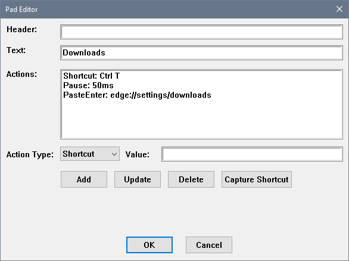
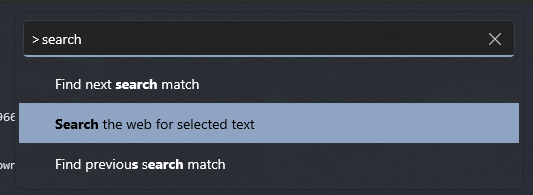

# Pads and Actions

Pads are the individual buttons shown in the 3x3 board grid. Each pad can display text, an icon, and execute a series of actions when activated. This document describes the structure of pad configuration and all available action types.

## Pad Object

A pad object defines the appearance and behavior of a single button in the board.

### Pad Properties

| Property | Type | Required | Description |
|----------|------|----------|-------------|
| `header` | `string` | ❌ | Header text displayed at the top of the pad (smaller text) |
| `text` | `string` | ❌ | Main text content displayed on the pad |
| `icon` | `string` | ❌ | Icon file path relative to `resources/icons`, supports `.png` and `.svg` |
| `text_style` | `string` | ❌ | Name of text style to use (overrides board's text style) |
| `color_scheme` | `string` | ❌ | Name of color scheme to use (overrides board's color scheme) |
| `actions` | `array` | ❌ | List of actions to execute when the pad is pressed |
| `board` | `string` | ❌ | Name of board to navigate to after executing actions |
| `board_params` | `array` | ❌ | Optional parameters to pass when navigating to another board |

### Empty Pads

An empty pad is represented by an empty object `{}`. Empty pads create gaps in the 3x3 grid layout and don't respond to user interaction.

**Example:**
```json
{
  "items": [
    {"text": "Action 1", "actions": [...]},
    {},
    {"text": "Action 3", "actions": [...]}
  ]
}
```

### Basic Pad Example

```json
{
  "header": "file operations",
  "text": "Save All",
  "actions": [
    {"Shortcut": "Ctrl Shift S"}
  ]
}
```

### Pad with Custom Styling

```json
{
  "header": "important",
  "text": "Deploy",
  "icon": "deploy.svg",
  "color_scheme": "Red",
  "text_style": "bold",
  "actions": [
    {"Command": "deploy.sh"}
  ]
}
```

### Pad with Board Navigation

```json
{
  "text": "More Actions...",
  "actions": [],
  "board": "advanced-actions"
}
```

When a `board` property is specified, the board navigation occurs after all actions are executed. This is useful for:
- Creating nested board hierarchies
- Repeating actions (e.g., zoom in/out) by navigating back to the same board

---

## ActionType

Actions are the operations executed when a pad is pressed. Actions are executed sequentially in the order they appear in the `actions` array. Each action is an object with a single key-value pair representing the action type and its parameter.

### Available Action Types

1. **Shortcut** - Send keyboard shortcuts
2. **Text** - Type text without pressing Enter
3. **Line** - Type text and press Enter
4. **Paste** - Copy text to clipboard and paste with Ctrl+V
5. **PasteEnter** - Copy text to clipboard, paste, and press Enter
6. **Pause** - Wait before executing the next action
7. **Command** - Execute a shell command
8. **OpenUrl** - Open a URL in the default browser
9. **Custom** - Custom action type for extensions

---

### Shortcut

Sends keyboard shortcuts to the target application.

**Format:** `{"Shortcut": "key combination"}`

#### Syntax Rules

**Key Separators:**
- Use **space** to separate keys within a single key combination (e.g., `Ctrl C`, `Ctrl Shift S`)
- Use **`+`** to separate chord sequences - multiple key combinations pressed in sequence (e.g., `Ctrl K + Ctrl B`)

**Case Insensitivity:**
- Shortcut definitions are case-insensitive
- Extra whitespace is ignored
- All of these are equivalent:
  ```
  Ctrl Alt P
  ctrl alt p
  CTRL ALT P
  cTrL aLt  P
  ```

**Quote Rules:**
- Letters, numbers, and symbols can be used with or without single quotes
- The **`+` symbol** MUST be wrapped in single quotes when used as part of the shortcut itself
- The `+` without quotes is used only to connect chord sequences

**Examples:**

Single shortcut:
```json
{"Shortcut": "Ctrl C"}
```

Multiple modifier keys:
```json
{"Shortcut": "Ctrl Shift S"}
```

Chord sequence (press Ctrl+K, then Ctrl+B):
```json
{"Shortcut": "Ctrl K + Ctrl B"}
```

Three-part chord sequence:
```json
{"Shortcut": "Ctrl K + Ctrl B + Ctrl S"}
```

Using the plus symbol as a key (quoted):
```json
{"Shortcut": "Ctrl Shift '+'"}
```

Combining minus and plus symbols:
```json
{"Shortcut": "Ctrl Shift '-' + Ctrl Shift '+'"}
```
or without quotes for minus:
```json
{"Shortcut": "Ctrl Shift - + Ctrl Shift '+'"}
```

#### Supported Key Names

All key names are case-insensitive.

**Letters:** `A` through `Z`

**Numbers:** `0` through `9`

**Modifier Keys:**
| Key Name | Description | Key Code |
|----------|-------------|----------|
| `Shift` | Shift key | 0x10 |
| `Ctrl` | Control key | 0x11 |
| `Alt` | Alt key | 0x12 |
| `LShift` | Left Shift | 0xA0 |
| `RShift` | Right Shift | 0xA1 |
| `LCtrl` | Left Control | 0xA2 |
| `RCtrl` | Right Control | 0xA3 |
| `LAlt` | Left Alt | 0xA4 |
| `RAlt` | Right Alt | 0xA5 |
| `LWin` | Left Windows key | 0x5B |
| `RWin` | Right Windows key | 0x5C |

**Function Keys:** `F1` through `F24` (0x70 - 0x87)

**Navigation Keys:**
| Key Name | Description | Key Code |
|----------|-------------|----------|
| `Larrow` | Left arrow | 0x25 |
| `Uarrow` | Up arrow | 0x26 |
| `Rarrow` | Right arrow | 0x27 |
| `Darrow` | Down arrow | 0x28 |
| `Home` | Home key | 0x24 |
| `End` | End key | 0x23 |
| `PgUp` | Page Up | 0x21 |
| `PgDown` | Page Down | 0x22 |

**Editing Keys:**
| Key Name | Description | Key Code |
|----------|-------------|----------|
| `Back` | Backspace | 0x08 |
| `Tab` | Tab key | 0x09 |
| `Enter` | Enter/Return | 0x0D |
| `Esc` | Escape | 0x1B |
| `Space` | Spacebar | 0x20 |
| `Ins` | Insert | 0x2D |
| `Del` | Delete | 0x2E |
| `Clear` | Clear | 0x0C |

**Numpad Keys:**
| Key Name | Description | Key Code |
|----------|-------------|----------|
| `Numpad0` through `Numpad9` | Numpad digits | 0x60 - 0x69 |
| `Multiply` | Numpad * | 0x6A |
| `Add` | Numpad + | 0x6B |
| `Subtract` | Numpad - | 0x6D |
| `Decimal` | Numpad . | 0x6E |
| `Divide` | Numpad / | 0x6F |

**Lock Keys:**
| Key Name | Description | Key Code |
|----------|-------------|----------|
| `CapsLock` | Caps Lock | 0x14 |
| `NumLock` | Num Lock | 0x90 |
| `ScrlLock` | Scroll Lock | 0x91 |

**Special Keys:**
| Key Name | Description | Key Code |
|----------|-------------|----------|
| `Pause` | Pause/Break | 0x13 |
| `PrtScrn` | Print Screen | 0x2C |
| `Select` | Select key | 0x29 |
| `Print` | Print key | 0x2A |
| `Execute` | Execute key | 0x2B |
| `Help` | Help key | 0x2F |

**Symbols and Punctuation:**

All standard keyboard symbols are supported. When using the `+` symbol as part of a shortcut (not as a chord separator), it must be wrapped in single quotes:
- Correct: `Ctrl Shift '+'`
- Incorrect: `Ctrl Shift +`

Other symbols like `-`, `,`, `.`, `/`, `[`, `]`, etc., can be used with or without quotes

---

## Text vs Paste Actions

HotKeys provides two approaches for entering text: **typing** (Text/Line) and **pasting** (Paste/PasteEnter). Understanding when to use each is important for reliable and fast automation.

### Typing Actions (Text/Line)
- Simulate keyboard input character by character
- Application receives each keystroke individually
- Application can respond to each character (autocomplete, validation, rendering)

### Pasting Actions (Paste/PasteEnter)
- Copy text to clipboard and paste as a single operation
- Application receives entire text at once
- Faster and more reliable in many scenarios

### When to Use Paste Instead of Text

**1. Speed**

Many applications are slow to render or process individual keystrokes. This makes typing actions visibly slower:

```json
// Slow - browser renders after each character, you can see it typing
{"Line": "https://very-long-url.com/path/to/page?param=value"}

// Fast - entire URL appears instantly
{"PasteEnter": "https://very-long-url.com/path/to/page?param=value"}
```

**Real-world examples:**
- Browser address bars rendering suggestions after each character
- VS Code command palette (Ctrl+Shift+P) updating filtered results after each keystroke
- Terminal autocomplete triggering on each character

**2. Avoiding Auto-completion Interference**

Some editors automatically insert closing brackets, quotes, or parentheses. Typing actions trigger these features, but pasting does not:

```json
// Using Text - IDE adds closing brackets automatically
{"Text": "Options [A, B, C]"}
// Result: "Options [A, B, C]]"  ❌ Extra bracket!

// Using Paste - text inserted as-is
{"Paste": "Options [A, B, C]"}
// Result: "Options [A, B, C]"   ✓ Correct!
```

**Applications with aggressive auto-completion:**
- VS Code, Sublime Text, IntelliJ IDEA
- Modern text editors with bracket pair colorization
- IDEs with smart code completion

**3. Special Characters and Formatting**

Paste actions handle special characters and formatted text more reliably than simulated keystrokes.

### When to Use Text Instead of Paste

**1. Building Dynamic Input**

When you need to combine clipboard content with typed text:

```json
{
  "text": "SCP Upload",
  "actions": [
    {"Shortcut": "Ctrl C"},      // Copy filename from selection
    {"Text": "scp "},            // Type command prefix
    {"Shortcut": "Ctrl V"},      // Paste filename
    {"Text": " user@host:/path/"} // Type destination
  ]
}
```

**2. Preserving Clipboard Content**

Text actions don't modify the clipboard, which is important when the clipboard contains something valuable that the user wants to keep.

**3. Compatibility**

Some applications or contexts may not respond properly to paste commands but work fine with simulated keystrokes.

---

### Text

Sends text to the target application without pressing Enter at the end. Text is simulated character by character.

**Format:** `{"Text": "text to type"}`

**Example:**
```json
{
  "text": "Type command prefix",
  "actions": [
    {"Text": "docker exec -it "},
    {"Shortcut": "Ctrl V"}
  ]
}
```

**Use cases:**
- Typing partial commands
- Entering text that will be completed by the user
- Building complex command lines with clipboard content
- When you need to preserve clipboard content

---

### Line

Sends text to the target application followed by an Enter key press. Text is simulated character by character.

**Format:** `{"Line": "text to type"}`

**Example:**
```json
{
  "text": "Run build",
  "actions": [
    {"Line": "npm run build"}
  ]
}
```

**Use cases:**
- Executing complete commands
- Submitting forms
- Entering complete lines of text
- When you need to preserve clipboard content

---

### Paste

Copies the specified text to the clipboard and sends Ctrl+V to paste it into the target application.

**Format:** `{"Paste": "text to paste"}`

**Example:**
```json
{
  "text": "Search docs",
  "actions": [
    {"Shortcut": "Ctrl Shift P"},
    {"Paste": "Search the web for selected text"},
    {"Pause": 150},
    {"Shortcut": "Enter"}
  ]
}
```

**Use cases:**
- Fast text entry (VS Code command palette, browser address bar)
- Entering text with brackets or quotes (avoiding auto-completion issues)
- Pasting URLs or long strings
- Entering text with special characters

**Note:** This action modifies the clipboard content.

---

### PasteEnter

Same as `Paste`, but automatically presses Enter after pasting.

**Format:** `{"PasteEnter": "text to paste"}`

**Example:**
```json
{
  "text": "Open Downloads",
  "actions": [
    {"Shortcut": "Ctrl T"},
    {"PasteEnter": "edge://settings/downloads"}
  ]
}
```

**Use cases:**
- Opening specific URLs in browsers (fast, no character-by-character rendering)
- Submitting commands with special characters
- Quick form submissions

**Note:** This action modifies the clipboard content.

---

### Pause

Pauses execution for a specified number of milliseconds before executing the next action.

**Format:** `{"Pause": milliseconds}`

**Example:**
```json
{
  "text": "SSH Login",
  "actions": [
    {"PasteEnter": "ssh user@hostname"},
    {"Pause": 2000},
    {"Line": "password123"}
  ]
}
```

**Use cases:**
- Waiting for menus to open
- Allowing time for new tabs/windows to load
- Waiting for network operations (SSH, SCP)
- Giving applications time to process previous actions

**Typical values:**
- 50-150ms: Short UI operations (menu opening)
- 500-1000ms: Medium operations (new tab loading)
- 2000-5000ms: Long operations (SSH connection, network operations)

---

### Command

Executes a shell command asynchronously. The command runs in the background without waiting for completion, and output is ignored.

**Format:** `{"Command": "shell command"}`

**Example:**
```json
{
  "text": "Start Server",
  "actions": [
    {"Command": "docker start my-container"}
  ]
}
```

**Use cases:**
- Starting services or containers
- Running background scripts
- Launching applications
- System operations

**Note:** Commands run asynchronously with output redirected. Use this for "fire and forget" operations, not for commands where you need to see the output.

---

### OpenUrl

Opens the specified URL in the default web browser.

**Format:** `{"OpenUrl": "url"}`

**Example:**
```json
{
  "text": "GitHub",
  "icon": "github.svg",
  "actions": [
    {"OpenUrl": "https://github.com"}
  ]
}
```

**Use cases:**
- Quick access to frequently used websites
- Opening documentation
- Accessing web applications
- Opening local HTML files

---

### Custom

Custom action type for plugin or extension support. The behavior depends on the custom action handler implementation.

**Format:** `{"Custom": {"type": "handler_name", "params": [{"name": "...", "value": "..."}]}}`

**Example:**
```json
{
  "text": "Custom Action",
  "actions": [
    {
      "Custom": {
        "type": "my_custom_handler",
        "params": [
          {"name": "param1", "value": "value1"},
          {"name": "param2", "value": "value2"}
        ]
      }
    }
  ]
}
```

**Use cases:**
- Extending HotKeys with custom functionality
- Integration with external systems
- Application-specific operations not covered by built-in actions

---

## Action Composition

Actions can be combined to create complex workflows. Here are some common patterns:

### Copy-Modify-Execute Pattern
```json
{
  "text": "SCP Upload",
  "actions": [
    {"Shortcut": "Ctrl C"},
    {"Text": "scp "},
    {"Shortcut": "Ctrl V"},
    {"Line": " user@host:/path/"}
  ]
}
```

### Menu-Navigate-Select Pattern
```json
{
  "text": "Find Command",
  "actions": [
    {"Shortcut": "Ctrl Shift P"},
    {"Paste": "Command Name"},
    {"Pause": 100},
    {"Shortcut": "Enter"}
  ]
}
```

### Wait-Authenticate Pattern
```json
{
  "text": "SSH with Password",
  "actions": [
    {"PasteEnter": "ssh user@server"},
    {"Pause": 2000},
    {"Line": "password"}
  ]
}
```

---

## Pad Configuration Examples

Pads can be configured using the built-in pad editor or by manually editing the configuration files.

### Using the Pad Editor

The application includes a visual pad editor accessible from the board interface. However, some advanced features are currently only available through manual JSON editing:

- Board navigation (`board` and `board_params` properties)
- Pad-specific color schemes (`color_scheme` property)
- Pad-specific text styles (`text_style` property)

For these features, you'll need to edit the configuration file directly using your configured text editor.

[](images/Image-4-pad-editor-edge-downloads.png)

### Example 1: Quick URL Access

**Scenario:** Open Microsoft Edge downloads page in a new tab

This example demonstrates fast URL entry using paste instead of typing. The browser automatically focuses the address bar when opening a new tab, so we can immediately paste and press Enter.

```json
{
  "text": "Downloads",
  "actions": [
    { "Shortcut": "Ctrl T" },
    { "PasteEnter": "edge://settings/downloads" }
  ]
}
```

**Why paste instead of type?** Browsers render suggestions after each character when typing, making the action visibly slower. Pasting inserts the entire URL instantly.

---

### Example 2: Menu Navigation with Search

**Scenario:** Search the web for selected text in Windows Terminal

This example shows how to automate command palette navigation—a common pattern in modern applications like VS Code, Windows Terminal, and JetBrains IDEs.

[](images/Image-6-windows-terminal-command-menu.png)

```json
{
  "header": "search selection",
  "text": "search web",
  "actions": [
    { "Shortcut": "Ctrl Shift P" },
    { "Paste": "Search the web for selected text" },
    { "Pause": 150 },
    { "Shortcut": "Enter" }
  ]
}
```

**How it works:**
1. `Ctrl Shift P` opens the command palette
2. Paste action inserts the exact command name (faster than typing and avoids autocomplete interference)
3. Brief 150ms pause allows the menu to filter and highlight the matching command
4. Enter executes the selected command

**Why use Paste here?** Command palettes typically filter results after each keystroke. Pasting is faster and more reliable than typing character by character.

---

### Example 3: Dynamic Command Construction

**Scenario:** Upload selected file via SCP to a remote server

This example demonstrates combining clipboard content with typed text to build dynamic commands, and handling interactive authentication.

```json
{
  "header": "home ubuntu",
  "text": "scp put",
  "actions": [
    { "Shortcut": "Ctrl C" },
    { "Text": "scp " },
    { "Shortcut": "Ctrl V" },
    { "Text": " ivica@192.168.1.13:Downloads/" },
    { "Shortcut": "Enter" },
    { "Pause": 2000 },
    { "Line": "your_password_here" }
  ]
}
```

**How it works:**
1. `Ctrl C` copies the selected filename to clipboard
2. Type `scp ` command prefix
3. `Ctrl V` pastes the filename from clipboard
4. Type the destination path
5. `Enter` executes the command
6. Wait 2 seconds for SSH connection to establish and prompt for password
7. Enter the password

**Note:** For improved security, consider using SSH key authentication instead of hardcoding passwords in configuration files.

---

### Example 4: Board Navigation

**Scenario:** Create hierarchical board structures or repeatable actions

Board navigation allows you to create multi-level menu systems or actions that loop back to the same board.

**Simple navigation to a sub-board:**
```json
{
  "text": "more...",
  "actions": [],
  "board": "code/more"
}
```

**Repeatable action pattern (zoom controls):**
```json
{
  "text": "Zoom In",
  "actions": [
    { "Shortcut": "Ctrl +" }
  ],
  "board": "some_board"
}
```

When `board` is specified, navigation happens after all actions execute. The zoom example is particularly useful—after zooming once, the same board reappears, allowing multiple zoom increments without repeatedly triggering the global hotkey.

---

### Example 5: Custom Styling Per Pad

**Scenario:** Override board defaults for specific pads to create visual hierarchy

Individual pads can have custom color schemes, text styles, and icons that override the board's defaults. This is useful for highlighting important actions or grouping related pads visually.

```json
{
  "text": "Deploy to Prod",
  "color_scheme": "Red",
  "text_style": "bold",
  "icon": "warning.svg",
  "actions": [
    { "Command": "deploy.sh production" }
  ]
}
```
**Styling properties:**
- `color_scheme`: Reference to a named color scheme from your configuration
- `text_style`: Reference to a named text style from your configuration
- `icon`: Path relative to `resources/icons/` directory (supports `.png` and `.svg`)

**Use cases:**
- Highlight destructive operations (red color scheme)
- Mark frequently-used actions (distinct icon)
- Create visual groupings (similar color schemes for related pads)
